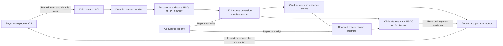

# ETHOnline 2026 — final form copy

Prepared September 12, 2026 against production `b9dfedf` / v0.22.65 and the form
provided by the project owner. This is a prepared submission, not proof of upload,
track selection, eligibility or final submission.

## Project details

Name: **Keryx**

Category: **Artificial Intelligence**

Emoji: **🔎**

Live demonstration: **https://keryx.cc/research**

Public repository: **https://github.com/tang-vu/keryx** (primary; monorepo)

### Short description

Keryx pays cited sources and settles evaluated AI research jobs in USDC on Arc.

### Description

Keryx turns a question and a USDC budget into an inspectable research job. Its agent discovers sources, explains BUY/SKIP/CACHE decisions, buys selected content through x402, and produces a cited answer. Creators receive weighted USDC rewards for cited contributions that pass the evidence checks.

For ETHOnline, we extended an existing research engine with a buyer workspace and an independent buyer client. Buyers can inspect package pricing, prepare requests, follow jobs, review source decisions and quotations, and recover an existing purchase after losing a response. The client checks the recipient, network, asset and spending limit, records durable recovery state, and verifies portable receipts against the request and returned result.

The workspace distinguishes a completed job from a sufficiently supported answer. It exposes quality limits, settled and pending creator amounts, and unused creator reserve. Packages are prepaid and fixed-price; unused reserve is not an automatic refund. This is not an on-chain escrow marketplace with evaluator-triggered release or refunds.

Keryx is a Continuity Track project. The research engine, payment rails, registry and durable server jobs existed before the event. Event work includes buyer checkout and recovery, evidence-quality improvements, creator controls and operational hardening. Our demonstrations use owner-operated Arc Testnet pilots; we do not claim independent customer adoption or mainnet readiness. Pre-event baseline: 5e83d45 (September 2). Dated event log: https://github.com/tang-vu/keryx/blob/main/docs/ethonline-2026.md

### How it's made

The app uses Next.js, React and TypeScript, with a SQLite database on the production VPS and a Supabase/PostgreSQL adapter available behind the same database interface. A durable asynchronous worker runs the research pipeline. Model-assisted planning and synthesis are combined with source decisions, quotation checks, explicit evidence coverage and bounded payment allocation.

Arc Testnet is the deployed EVM network and USDC is the payment unit. The Solidity SourceRegistry records source ownership and payout configuration. viem connects application and wallet actions to Arc; Hardhat tests the contracts locally. Circle Gateway and the x402 batching tools connect paid source access and citation rewards to USDC payment flows. Cached content can avoid a new access toll while still earning a reward when cited.

Our event work focuses on the buyer boundary: checking payment challenges against pinned terms, journaling before a purchase, retaining uncertain states after a lost response, and resuming the original job instead of buying again. Browser recovery uses durable local storage and cross-tab coordination. Portable receipt verification binds the saved request to the returned answer and payment ledger; it does not independently prove blockchain finality.

Paid pilots exposed question-interpretation and receipt-projection defects, which drove targeted fixes and regression tests. Later work added creator authority checks, funding-recovery safeguards and incremental archive reads to reduce transient memory use. Vitest, Chromium checks, TypeScript, contract tests and production checks support the implementation. A revision-checked registry V2 is a separate tested candidate, not a deployed replacement. The public continuity log identifies the pre-event baseline and event changes.

## Tech stack selections

Choose the closest actual options in each multiselect; use Other/custom entries where supported.

| Field | Values |
| --- | --- |
| Ethereum developer tools | Hardhat; viem; wagmi; WalletConnect, if listed |
| Blockchain networks | Arc Testnet / Arc (custom entry if needed) |
| Programming languages | TypeScript; JavaScript; Solidity; SQL; HTML/CSS if offered |
| Web frameworks | Next.js; React; Tailwind CSS |
| Databases | SQLite (production); Supabase / PostgreSQL (supported adapter) |
| Design tools | None / Other: code-based HTML, CSS and SVG; do not claim Figma use |
| Other technologies | Circle Gateway; x402; Circle x402 batching / Nanopayments; USDC; Unified Balance Kit; Playwright; Vitest; IPFS / Pinata; Node.js |

Do not select Ethereum mainnet, additional partner networks, Circle App Kit or Agent
Stack integrations solely because they appear in sponsor materials. The submission
claims the repository's actual Arc/Gateway/x402 integration.

### AI tools disclosure

OpenAI Codex assisted substantially with implementation, debugging, test generation, documentation and release checks during the event. Areas include the buyer client and recovery journals in lib/buyer, the research workspace components, evidence-quality regressions, creator listing safeguards and archive memory handling. The project owner defined product requirements and constraints, selected priorities, funded testnet wallets and reviewed progress. We do not claim that all submitted code was written manually.

Runtime language models are a separate part of the product: they assist question planning, source selection, synthesis and evidence assessment, while application code enforces payment limits and recovery rules. The submission text and code-based media preparation were also AI-assisted. An older rehearsal used Microsoft David synthetic narration; it is not the final submission video because the event forbids TTS/AI voiceovers. The final export uses ten voice recordings supplied by the project owner, with volume normalization and no speech synthesis or playback speed-up.

## Judging and prizes

- Track: **Continuity Track**; verify the project and team member are on the same track.
- Submission type: **Top 10 Finalist & Partner Prizes**, as requested by the owner,
  conditional on Continuity eligibility under the event rules and dashboard.
- Partner: **Arc**. No second or third partner is claimed without an actual integration.
- Intended bounty: **Best DeFi or Agentic Application (Continuity)**.

### Arc prize explanation

We are applying for Arc's Best DeFi or Agentic Application bounty for Continuity projects. Keryx uses Arc Testnet and USDC for an agentic research payment workflow: a buyer pays for a bounded research package, the worker chooses paid or cached sources, and eligible cited creators receive weighted rewards through the x402/Circle Gateway payment paths. Arc SourceRegistry supplies source ownership and payout authority.

During ETHOnline we extended the existing payment engine with a buyer workspace, durable buyer-side recovery, receipt checks and evidence-quality improvements. The distinctive behavior is that price, payment uncertainty and research support remain visible together: a completed job can still have insufficient evidence, and a lost response is recovered without another purchase. Our video demonstrates an existing owner-operated testnet pilot; screenshots show the current workspace. The architecture diagram, continuity history and reproducible tests are linked in the repository.

This is an Arc Testnet submission. We are not claiming an escrow contract, independent paid traction, a deployed registry V2, or completion of the separate mainnet requirement.

### Partner feedback, if a field appears

Gateway/x402 makes small source-access and citation payments practical without forcing the product to treat every payment reference as a separate on-chain transaction. The most demanding integration work was preserving uncertainty across lost responses and reconciling payment references with durable job receipts. Clear examples for recovery, transfer status and the distinction between a transfer ID and a finalized transaction hash would make this workflow easier for other builders.

## Future opportunities

The owner intends to continue the project. Select continuing development and grants /
accelerator interest where offered. Do not select unrelated employment or investment
commitments by default.

### Future plans, if a text field appears

We plan to improve repeatable research quality, validate the buyer and creator journeys with independent users, and make recovery and receipts easier for third-party developers to integrate. Operational priorities are monitoring, restore drills and reliable handling of uncertain payments. Mainnet is a separate milestone requiring network support, contract and payment review, independent acceptance and an explicit launch decision. The operating-cost and profit analysis remains private.

## Continuity evidence

- Pre-event baseline: [`5e83d45`](https://github.com/tang-vu/keryx/commit/5e83d45), September 2.
- Product release used for final screenshots: [`b9dfedf`](https://github.com/tang-vu/keryx/commit/b9dfedf).
- [Event product diff](https://github.com/tang-vu/keryx/compare/5e83d45...b9dfedf).
- [Dated continuity log](./ethonline-2026.md).
- [September 9 paid pilot](./engineering/pilot-2026-09-09.md).
- [Video provenance](./engineering/walkthrough-2026-09-09.md).
- [Latest archive validation](./engineering/archive-memory-2026-09-12.md).

## Media and remaining action

Prepared upload directory: `.artifacts/ethonline-final-2026-09-12/`.

| Field | File |
| --- | --- |
| Logo | `01-logo-512.png` |
| Cover | `02-cover-1920x1080.png` |
| Screenshot 1 | `03-screenshot-research-workspace.png` |
| Screenshot 2 | `04-screenshot-recovered-job.png` |
| Screenshot 3 | `05-screenshot-source-decisions.png` |
| Screenshot 4 | `06-screenshot-claim-evidence.png` |
| Optional architecture image | `07-architecture-1600x900.png` |
| Final video — owner voice recordings | `08-keryx-ethonline-FINAL-human-voice.mp4` |

The four screenshots are current production captures, not fabricated UI. Job screenshots
reopen the existing September 9 pilot with its bearer input masked. The logo reuses the
existing SVG identity. The cover and architecture are code-rendered illustrations.
The final 168.64-second video uses ten voice recordings supplied by the owner.
It preserves the older walkthrough and labelled selected CLI stdout at normal speed,
adding 11.28 seconds of still-frame holds so longer speech stays within its scene.
The MP4 contains H.264 video at 1440 × 1000 and AAC audio; full decoding passed and
measured peak audio was -2.0 dB. No synthesized voice, music or speed-up was added.
Automated transcription was low-confidence and is not a claim of word-perfect speech;
the owner should listen to the export before uploading. The [narration guide](./ethonline-human-narration.md)
retains the original rehearsal timings; final timings are in the local media provenance.

## Final checks before submission

The official [event details](https://ethglobal.com/events/ethonline2026/info/details),
checked September 12, list submission at September 13, 12:00 EDT — **September 13,
23:00 in Vietnam**. This is earlier than the September 16 date in earlier promotional
material; use the earlier deadline and verify the dashboard. The page requires a
2–4 minute video, at least 720p, no playback speed-up, and no TTS/AI voiceover.
Do not upload the older synthetic-narration rehearsal or the silent template as final.

[ETHGlobal pre-existing-work rules](https://ethglobal.com/rules) require Continuity
work and the prior baseline to be disclosed. The pasted Final screen still shows
from-scratch declarations. After selecting Continuity, revisit that screen. If those
declarations remain mandatory, obtain organizer guidance instead of affirming them.
Prior grant/showcase or hackathon submissions must also be disclosed accurately; do
not blindly accept the statement about never submitting to another hackathon.

The [Arc prize page](https://ethglobal.com/events/ethonline2026/prizes/arc) explicitly
lists the Continuity bounty and a separate mainnet-contingent portion. That condition
is not a completed feature or permission to launch mainnet.

Optional organizer clarification to send if the incompatible declarations remain:

> Keryx is an existing open-source project entered for the Continuity Track. Our
> pre-event baseline is commit 5e83d45, and the submission documents the new ETHOnline
> work. We would like Top 10 Finalist and Arc Continuity prize consideration. The Final
> screen still requires starting-from-scratch/no-prior-work declarations. Could you
> confirm the correct Continuity submission path and which declarations apply?

No event form, legal declaration, upload or message to organizers has been submitted
as part of preparing these files.
