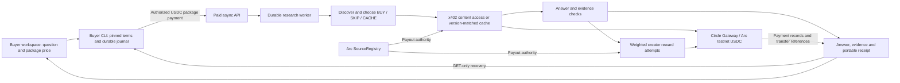

# ETHOnline 2026 submission working draft

Prepared September 9 from repository history and verified pilot records. This is
copy for the owner to adapt to the actual submission form, not a submitted entry.
The currently visible final form fields and limits have not been inspected.

## Project and links

- Name: Keryx
- Category: Artificial Intelligence
- Track: Continuity (intended; confirm the dashboard's actual selection)
- Primary intended Arc bounty: Best DeFi or Agentic Application (Continuity)
- Live app: https://keryx.cc/research
- Repository: https://github.com/tang-vu/keryx
- Existing project page: https://ethglobal.com/showcase/keryx-sv1zi
- Demo video URL: not yet published; local rehearsal artifacts are documented below.

## Short description

Keryx pays cited sources and settles evaluated AI research jobs in USDC on Arc.

## What it does

Keryx is a citation-toll research agent. A buyer supplies a question and USDC budget.
The agent discovers source material, explains BUY/SKIP/CACHE choices, pays for selected
x402 content when needed, and produces an answer linked to source quotations. Creator
rewards depend on cited contributions that pass the evidence checks.

The buyer workspace separates package price, research quality and creator accounting.
It shows the answer, research targets, evidence, recorded source decisions, settled
and pending creator amounts, and unused reserve. Completing a job does not establish
adequate evidence, and unused reserve under the fixed-price package is not a refund.

An independent buyer CLI checks the payment challenge against a pinned recipient,
Arc testnet, USDC and an all-in spending limit. It journals the job before submission.
After losing a response, the buyer resumes the same job without signing or submitting
another purchase. The CLI also checks portable receipt integrity and binding to the
original request and returned answer.

## What we built during ETHOnline

Keryx existed before this event. Our inspected baseline is `5e83d45` from September 2.
The event work turns the existing research/payment engine into a clearer buyer flow
and uses paid pilots to find and repair research-quality failures:

- A buyer workspace for preparing priced requests and following paid jobs, including
  explicit unavailable/insufficient quality states and expandable source decisions.
- A separate buyer CLI with pinned payment terms, bounded spending, durable local
  recovery and immutable receipt snapshots.
- Planning that preserves question scope and distinguishes source/style instructions
  from substantive information needs.
- Relevant verbatim source passages, bounded quote selection, explicit target IDs
  and a relevance review that can only lower proposed evidence support.
- A first-party Engineering source with full articles, owner-signed registry
  registration and verified RSS ownership, plus reproducible model diagnostics.
- A portable receipt fix that includes access tolls alongside citation rewards,
  discovered when a paid pilot's receipt omitted an already-recorded access payment.

Browser co-signing, SourceRegistry, encrypted content, the evidence ledger, paid A2A
v2, durable server jobs, package contracts and portable receipts predate this event.
We are extending those systems, not claiming to have built all payment rails during
ETHOnline. [Dated continuity log](./ethonline-2026.md).

## How Arc and Circle are used

Arc testnet is the deployed EVM network. SourceRegistry records creator authority
and payout configuration. USDC denominates the buyer package and downstream source
payments. Circle's x402/Gateway batching client supports source access and citation
reward payment flows. The buyer signs only after checking the challenge against its
own policy; the server's research worker pays downstream creators under the job cap.

Access tolls and citation rewards are separate legs. A cached read can avoid a new
access toll while still earning a citation reward. The application retains pending
states and transfer references instead of fabricating success. Circle transfer IDs
are not automatically on-chain transaction hashes.

Relevant code: [buyer client](../lib/buyer/client.ts),
[buyer payment policy](../lib/buyer/policy.ts),
[research worker](../lib/a2a/run-order.ts),
[agent pipeline](../lib/agent/run-agent.ts),
[Gateway payment adapter](../lib/payments/real-gateway.ts),
[source endpoint](../app/api/source/[id]/route.ts),
[citation endpoint](../app/api/cite/[id]/route.ts),
[registry](../contracts/source-registry.sol).

## Architecture

## What the pilots demonstrate

| Pilot | Actual result | Limit |
| --- | --- | --- |
| September 8, new Engineering read | 0.05-USDC package; 0.002 access + 0.015 citation; corrected complete receipt | Coverage 1/1/0 because a redundant third target remained; first-party only |
| September 9, same English question | 31.6 seconds; two targets with coverage 0.8/0.9; 0.015 citation received; verified complete receipt | CACHE/SKIP, so no new access toll; one successful follow-up is not broad reliability |

Both are owner-operated Arc-testnet purchases. The later grounded rate of 1.0 means
both targets passed the existing threshold, not 100% factual correctness. Circle
returned the cited creator transfers as received without a batch transaction hash.
We do not claim external customers, mainnet revenue or independently verified chain
finality. [September 8 evidence](./engineering/pilot-2026-09-08.md) and
[September 9 evidence](./engineering/pilot-2026-09-09.md).

## Challenges and next steps

Early paid pilots exposed ambiguous question interpretation, poor source coverage,
mismatched quotation relevance, a redundant planning target and incomplete receipt
projection. We repaired those observed cases while retaining failed/partial results
in the build log. Broader English questions, repeatability, uncached follow-ups and
independent buyer validation remain work to do.

Mainnet is a separate migration and review. This submission does not claim that the
application already meets a September 30 mainnet-readiness condition.

## Owner handoff checklist

- Confirm Continuity Track selection and the final bounty selection in the dashboard.
- Adapt this text to the enabled final submission fields and their current limits.
- Publish a reviewed video and paste its public URL. The 177.12-second local rehearsal
  includes UI footage and labelled selected CLI stdout, has no audio and shows the
  older partial-quality pilot. Do not label it as the newer successful run.
- Review and upload the prepared five-slide presentation with its architecture page.
  The local PDF and checked-in HTML source are listed below; no deck upload has occurred.
- Submit through the owner account when the final form and artifacts are ready.

The [official prize listing](https://ethglobal.com/events/ethonline2026/prizes),
checked September 9, requests a functioning frontend/backend, architecture diagram,
video/presentation, documentation and source link; the intended bounty requires
Continuity registration. Eligibility and acceptance are organizer decisions. The
separate launch bounty includes a September 30 mainnet condition that this draft does
not assert. [Rehearsal provenance](./engineering/walkthrough-2026-09-09.md).

## Prepared presentation

- Editable, standalone source: [ethonline-presentation.html](./ethonline-presentation.html).
- Local PDF: `.artifacts/submission/keryx-ethonline-presentation.pdf`.
- Five pages: pitch, architecture, continuity work, pilot comparison and remaining work.
- Exported from Chromium with CSS page size 1280 x 720 and background graphics enabled.
  Open the HTML in a browser and print to PDF using its CSS page size to regenerate.
- SHA-256: `f49f5676a6a00ed6def3d4381efeaf12104c577b665c9db59b3a31f1b5a95fb3`.
- Validation: five PDF page objects, no HTML slide overflow, visual inspection of the
  pilot-comparison slide. No bearer job identifiers or credentials are included.
